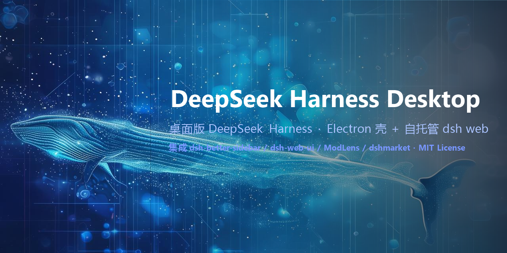

# dsh-desktop · DeepSeek Harness for Desktop

<div align="center">
  <a href="./README.md">简体中文</a> · <b>English</b>
</div>

<p align="center">
  
</p>


Put [DeepSeek Harness](https://github.com/deepseek-ai/deepseek-harness) (DSH) into a native desktop window: an **Electron shell + self-hosted `dsh web` service**. Every web feature is preserved, four open-source projects are pre-integrated, and desktop capabilities such as a system tray, native notifications and a plugin gallery are included.

## ✨ Features

- **All web features**: sessions / subagents / workflows / plan mode / goals / skills / tool approvals / settings / themes / plugin management… (it is the full `dsh web`)
- **System tray**: show/hide window, restart the DSH server, open in browser, plugin gallery, quit
- **Native notifications**: in-page notifications go through the OS notification center; a hint is shown when the window is hidden to tray
- **External links**: every external link opens in the system browser
- **Single-instance lock**: a second launch focuses the existing window
- **Graceful shutdown**: the dsh service process is stopped cleanly on quit
- **Plugin gallery**: ships the full [awesome-dsh-plugin](https://github.com/awesome-dsh-plugin/awesome-dsh-plugin) list (1054 plugins / 14 categories) with search, GitHub links and copy actions

## 🧩 Integrated open-source projects

| Project | Description | Author / License |
|---|---|---|
| [dsh-better-sidebar](https://github.com/omdsh-dev/DSH-better-sidebar) | Service-based sidebar workbench: file explorer + CodeMirror editor, embedded browser, real terminal (node-pty), Git panel, subagent topology, background jobs; the `ctx.betterSidebar` service lets other plugins register tabs / file viewers | [omdsh-dev](https://github.com/omdsh-dev) · MIT |
| [dsh-web-ui](https://github.com/zhu1090093659/dsh-web-ui) | DSH Web GUI plugin & skin family: Liang-shen mode agent preset, task board (cron execution included), Git graph, right-side panel (preview/files/SCM), mobile remote, SSH ops, image understanding, whale-girl pet, live stats, **skin center with 10 skins** | [zhu1090093659](https://github.com/zhu1090093659) · Apache-2.0 |
| [ModLens](https://github.com/liustack/modlens) | Vision engine plugin: gives text-only models sight, `modlens_read_image` tool + `(modlens vision)` model entries | [liustack](https://github.com/liustack) · MIT |
| [awesome-dsh-plugin](https://github.com/awesome-dsh-plugin/awesome-dsh-plugin) | Curated community plugin list (data source of the in-app gallery) | [awesome-dsh-plugin](https://github.com/awesome-dsh-plugin) · list document |
| [dshmarket](https://github.com/dsh-market/dsh-market) | Visual plugin market inside DSH settings: browse, one-click install/upgrade community plugins | [dsh-market](https://github.com/dsh-market) · MIT |
| [dsh-task-relay](https://github.com/LeslieWylie/dsh-task-relay) | Cross-session/subagent shared task queue + handoff summaries (task-dispatch backbone of the collab board) | [LeslieWylie](https://github.com/LeslieWylie) · MIT |
| [dsh-studio](plugins/dsh-studio/README.md) | In-repo workbench enhancement: sidebar "Skin Center" entry (local / Wallpaper Engine wallpapers with size/position/blur) + "Collab" board (subagent tree, task dispatch, message, interrupt) | this repo · MIT |

> The desktop app **shares the same `DSH_HOME`** with the web UI (`dsh web`): sessions, storage and profiles are fully continuous. The desktop server listens on `127.0.0.1:3081` by default (override with `DSH_DESKTOP_PORT`); it falls forward automatically when the port is busy.

> ⚠️ This app installs the third-party plugins above into your web profile. **Installing a plugin runs third-party code with your permissions** — review each repository before installing.

## 🏗️ Architecture

```
dsh-desktop/
├── src/
│   ├── main/
│   │   ├── main.js        # Electron main: window, tray, menu, IPC, lifecycle, smoke self-check
│   │   ├── server.js      # dsh web server manager: spawn, port probing, URL parsing, health check, graceful stop
│   │   ├── gallery.js     # plugin gallery window
│   │   ├── splash.html    # startup page
│   │   ├── error.html     # failure page
│   │   └── assets/        # app icons; drop your own into assets/whale/ (git-ignored) to override
│   ├── preload/preload.js # contextBridge: openExternal / serverStatus / restartServer / notify / galleryData
│   └── gallery/           # gallery frontend + plugins.json (generated by build-gallery.mjs)
├── scripts/
│   ├── setup.mjs          # one-command setup orchestrator
│   ├── setup-runtime.mjs  # DSH runtime check
│   ├── setup-profile.mjs  # installs the integrated plugins into the web profile (official dsh plugin channel + bundle reconciliation)
│   ├── build-gallery.mjs  # parses awesome-dsh-plugin README → plugins.json
│   ├── make-icon.mjs      # generates PNG/ICO icons from a square source image
│   └── ask-zhipu.mjs      # debugging tool for Zhipu GLM-4V-Flash (key read from local modlens config)
├── start.cmd              # Windows launcher (auto-installs missing deps)
├── install.cmd            # Windows one-command installer
└── package.json           # Electron + @deepseek-ai/dsh runtime
```

Startup chain:

```
npm start
  └─ Electron main process
       ├─ DshServer.start() → node …/dsh/lib/bin.js --profile web --port 3081
       │                     （shares $DSH_HOME/profiles/web：integrated plugins mounted）
       ├─ parses "dsh web: http://127.0.0.1:3081" → health check → load window
       └─ tray / notifications / external links / graceful shutdown
```

## 📦 Quick start

Prerequisites: Node.js ≥ 20 (on PATH). Windows / macOS / Linux.

```sh
npm install        # DSH runtime (@deepseek-ai/dsh) + Electron
npm run setup      # all automatic: ① initializes the ~/.dsh (DSH_HOME) skeleton
                   # ② bootstraps pnpm (PATH → corepack shim → local npm install into .tools)
                   # ③ installs the integrated plugins into the web profile
                   # ④ generates the plugin gallery data
npm start          # launch
```

**No manual pnpm installation and no prior official `dsh` run needed** — `npm run setup` handles everything. On Windows, double-clicking `start.cmd` is the easiest: it auto-runs `npm install` when deps are missing, auto-runs setup when needed, then launches.

Detailed `npm run setup` steps:
1. Creates the `~/.dsh` skeleton (profiles / sessions / storages);
2. Bootstraps pnpm (3-level fallback: PATH → corepack shim → local install inside `.tools`, no admin rights needed);
3. Initializes `~/.dsh/profiles/web` from the official template if missing;
4. Writes `minimumReleaseAgeExclude` (bypasses the pnpm 11 release-age gate) and `allowBuilds` (node-pty / ssh2 / cpu-features / cloudflared, avoiding the `ERR_PNPM_IGNORED_BUILDS` non-zero exit) into the profile's `pnpm-workspace.yaml`;
5. Runs `dsh plugin --profile web add` for each plugin (official channel; `dsh.bundle`-declaring packages join `dsh.profile.bundles` automatically; a failed add is retried);
6. Installs the dsh-web-ui aggregate with `--ignore-scripts` (its ssh2 / cloudflared / cpu-features native bindings are all optional and the plugins degrade gracefully — installation succeeds on any network/toolchain);
7. **Bundle reconciliation**: when pnpm exits non-zero due to native builds, the official reconcile is skipped — the script re-applies the same rule itself so every `dsh.bundle.patch`-declaring dependency joins the bundle stack.

## 🖥️ Usage

- **Launch**: `npm start` (or double-click `start.cmd` on Windows)
- **Closing the window ≠ quitting**: X hides to the tray (a notification explains this the first time); quit via tray right-click →「退出」
- **Tray menu**: show window / plugin gallery / restart DSH server / open in browser / quit
- **Plugin gallery**: app menu「插件 → 插件精选」
- **Skin Center**: sidebar 🎨 entry (same level as Check Updates / Mobile Remote) — pick a local or Wallpaper Engine wallpaper as the UI background with size/position/blur controls; one-click skin apply
- **Collab board**: sidebar 🤝 entry — live subagent tree of the current session; ▼ expands message / interrupt / dispatch-task actions
- **Custom icons**: put your own `icon-{16,32,256}.png` and `icon.ico` into `src/main/assets/whale/` — the app prefers them at startup (the directory is git-ignored)
- **Vision**: paste an image or ask the agent to read one (`modlens_read_image`), handled by ModLens (~5–10 s/image, needs a vision engine, see below)

### Vision engine (ModLens) configuration

ModLens's `openai` provider is a universal OpenAI-compatible socket; works directly in mainland China (example uses the free Zhipu GLM-4V-Flash):

```sh
modlens config set openai.baseUrl https://open.bigmodel.cn/api/paas/v4
modlens config set openai.apiKey  <your-key>
modlens config set openai.model   glm-4v-flash
modlens config set provider       openai
modlens doctor                    # verify
```

- The free tier is rate-limited (roughly tens of requests per minute), enough for daily use; upgrade to the `glm-4.6v` family if needed.
- Alternatives: Alibaba DashScope qwen-vl, SiliconFlow, local Ollama (`http://localhost:11434/v1` + `qwen2.5-vl`).
- Full docs: [ModLens](https://github.com/liustack/modlens).

### End-to-end self check

```sh
$env:DSH_DESKTOP_SMOKE='1'; npm start   # PowerShell
```

After the page loads, the app collects DOM evidence (client bundles of the integrated plugins, better-sidebar mount, plugin error count), prints `[smoke] RESULT: PASS/FAIL` and exits — usable in CI.

## ❓ FAQ

| Issue | Fix |
|---|---|
| Splash keeps spinning | First start installs plugins / builds node-pty and is slow — normal; on failure the error page shows hints |
| "profile not initialized" | Run `npm run setup` (auto-initializes ~/.dsh and installs plugins), or double-click `start.cmd` |
| Cannot find the window | It is hidden in the tray — click the tray icon, or run `npm start` again (single instance focuses the existing window) |
| setup could not bootstrap pnpm | Very rare: run `npm install -g pnpm` manually, then `npm run setup` again |
| Port busy | Default 3081 falls forward automatically; or set `DSH_DESKTOP_PORT` |
| Running alongside web `dsh web` | Two instances sharing one DSH_HOME risk concurrent session-file writes; run only one at a time |
| SSH crypto acceleration / cloudflared tunnel unavailable | The dsh-web-ui aggregate skips native build scripts by default (optional bindings). For full native features run `pnpm rebuild ssh2 cloudflared cpu-features` inside `~/.dsh/profiles/web` (needs a working build/download environment) |
| Old plugin versions installed | The profile already has `minimumReleaseAgeExclude`; if still stale, run `pnpm update @linxin666/dsh-web-ui-all` in `~/.dsh/profiles/web` |

## 🛠️ Development

```sh
npm install
npm run setup          # prepare profile & gallery data
npm run gallery:build  # regenerate gallery data (needs a third-party/awesome-dsh-plugin clone)
npm start              # launch
```

See [CONTRIBUTING.md](./CONTRIBUTING.md).

## 🙏 Credits

- [DeepSeek Harness](https://github.com/deepseek-ai/deepseek-harness) — the service kernel of this app (MIT)
- [dsh-better-sidebar](https://github.com/omdsh-dev/DSH-better-sidebar) by [omdsh-dev](https://github.com/omdsh-dev) (MIT)
- [dsh-web-ui](https://github.com/zhu1090093659/dsh-web-ui) by [zhu1090093659](https://github.com/zhu1090093659) (Apache-2.0)
- [ModLens](https://github.com/liustack/modlens) by [liustack](https://github.com/liustack) (MIT)
- [awesome-dsh-plugin](https://github.com/awesome-dsh-plugin/awesome-dsh-plugin) by [awesome-dsh-plugin](https://github.com/awesome-dsh-plugin)
- [dshmarket](https://github.com/dsh-market/dsh-market) by [dsh-market](https://github.com/dsh-market) (MIT)

## 📜 License

This project is licensed under the [MIT License](./LICENSE), © 2026 Azusa. The integrated plugins follow their own licenses (dsh-better-sidebar MIT, dsh-web-ui Apache-2.0, ModLens MIT, dshmarket MIT). The app icon is derived from a character sheet provided by the author.
